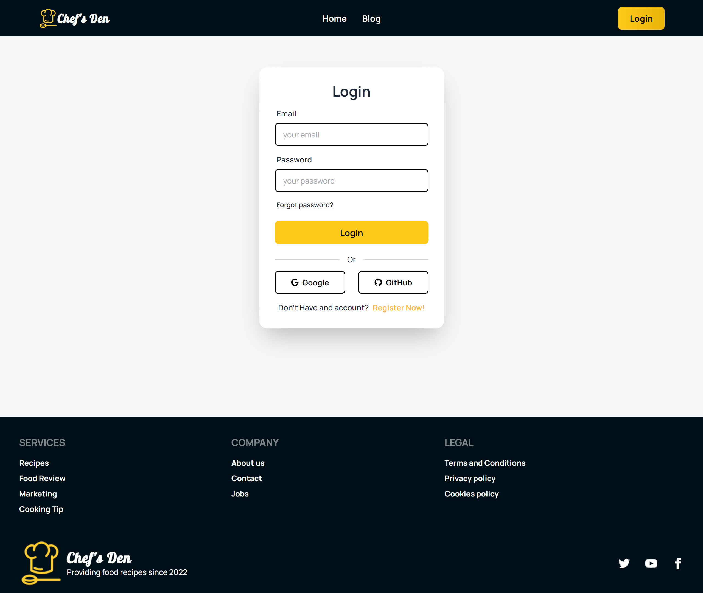
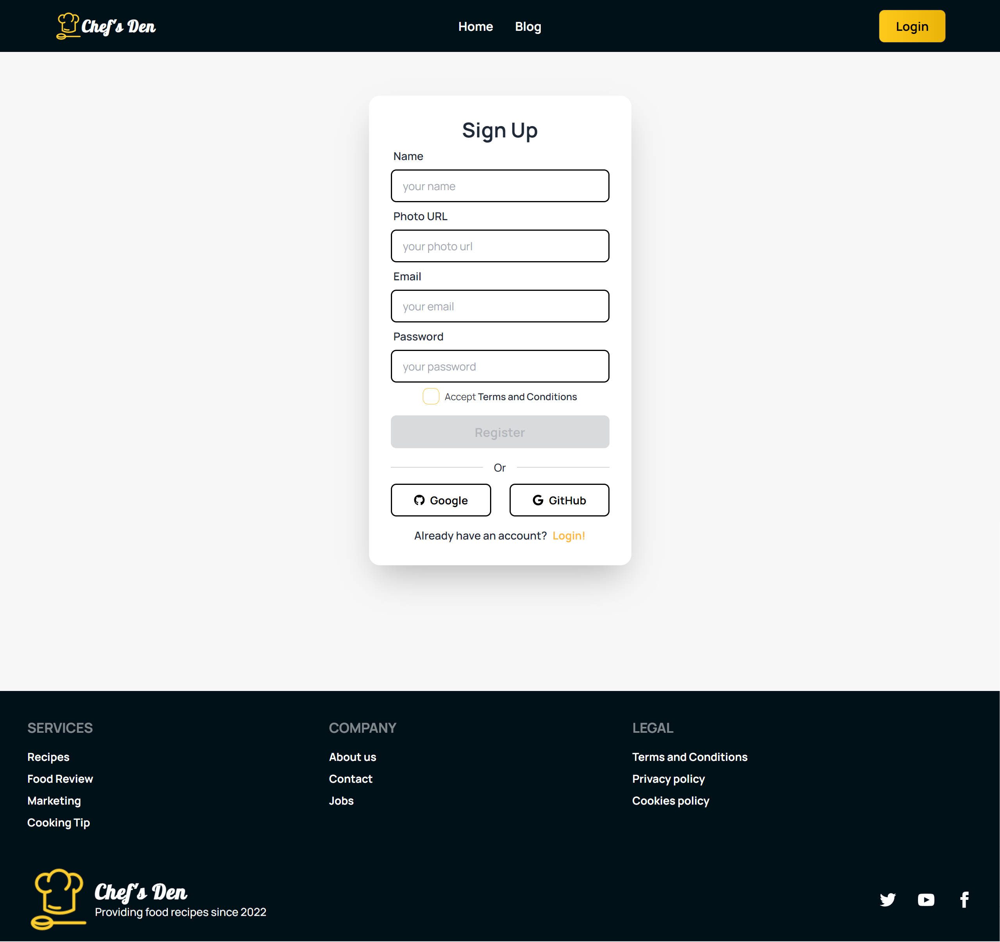
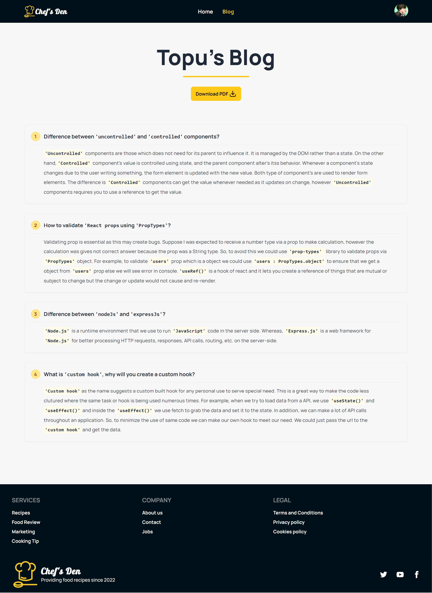

# Chef's Den

## A website to keep your food cravings in check. Pick you favorites from our curated Australian recipes by the world renowed Chefs.

### Visit Now: https://chef-recipe-hunter-clien-6e668.web.app/

### Features:

- Users will be able to Register using name, photo url, email and password.
- Users will be able to Login with email and password..
- Users will be able to Login with Google and GitHub.
- Users will be able to see profile image and name in a dropdown menu upon hovering over profile picture in the homepage.
- Users will be able to logout by hovering on the profile picture and clicking Logout from dropdown menu.
- Homepage shows top featured recipes.
- Featured recipes shows a image and rating of each recipe.
- Shows all the Australian Chefs' that are connected with us.
- Will be able to see each Chef's image, name, years of experience, number of recipes, number of likes, and a view recipe button to see each Chef's recipes.
- The homepage has a Cooking Tip section where the card shows different cooking tips/hacks along with the Chef's name everytime the site reload.
- Upon clicking a Chef's View Recipes button, user is forwarded to a page where there is 2 sections, one banner section about the chef and the other about the Chef's recipes.
- The banner show a image of the Chef, his/her name, short bio, years of experience, number of recipes, number of likes.
- Recipe Section shows all recipes, each having a name, a image, the list of ingredients, the list of cooking steps, along with rating and a Add to favorite button.
- Add to favorite button addeds the recipe to the user's favorite list, with a toast and disables the button afterwards.
- The site has a footer section for necessary details.
- There is a personal blog page about React.
- The blog page has a button to download the PDF of the blog section.
- The website is mobile and desktop responsive.
- Images are lazyloaded for better user experience.

